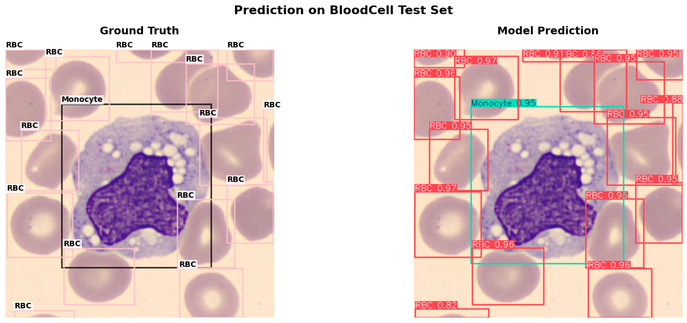
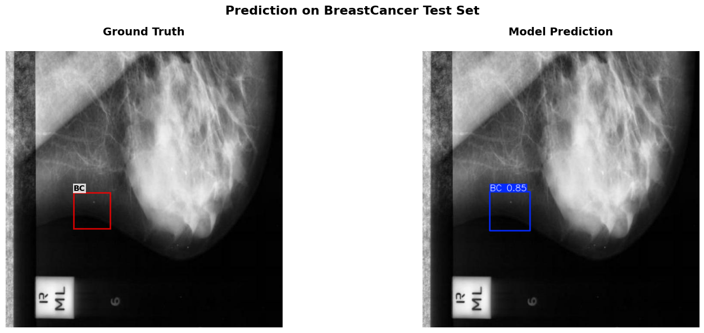
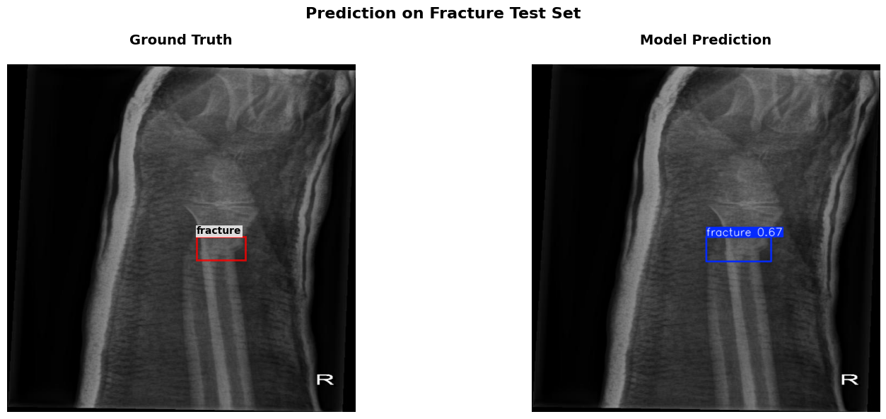

# 🏥 Medical Image Object Detection with YOLO11

## 📋 Overview

This project implements **object detection** using **YOLO11** for medical image analysis across three datasets: Blood Cell, Breast Cancer, and Fracture detection. Leverage pre-trained YOLO11 models for accurate medical object detection.

## 🤖 Pre-trained Models

All models available on 🤗 **Hugging Face Hub**:

- 🩸 **Blood Cell**: [Jesteban247/yolo11-blood_cell-onnx](https://huggingface.co/Jesteban247/yolo11-blood_cell-onnx)
- 🫃 **Breast Cancer**: [Jesteban247/yolo11-breast_cancer-onnx](https://huggingface.co/Jesteban247/yolo11-breast_cancer-onnx)
- 🦴 **Fracture**: [Jesteban247/yolo11-fracture-onnx](https://huggingface.co/Jesteban247/yolo11-fracture-onnx)

## 📁 Project Structure

```
├── 🧠 EDA.ipynb              # Dataset download & preprocessing
├── 🏋️ Experiments.py         # Training script
├── 📊 Analysis.ipynb         # Results analysis
├── 📊 Analysis_2.ipynb       # Additional analysis
├── 🔍 Prediction.ipynb       # Inference + visualization
├── 📈 Benchmark.py           # Benchmarking script
├── 📋 requirements.txt       # Dependencies
├── 📁 Images/                # Dataset and visualization images
└── 📁 runs/                  # Training logs
```

## 🚀 Quick Start

### 1. 🛠️ Environment Setup

```bash
# Install Miniconda
curl -O https://repo.anaconda.com/miniconda/Miniconda3-latest-Linux-x86_64.sh
bash Miniconda3-latest-Linux-x86_64.sh

# Initialize Conda
source ~/miniconda3/bin/activate

# Accept Terms of Service
conda tos accept --override-channels --channel https://repo.anaconda.com/pkgs/main
conda tos accept --override-channels --channel https://repo.anaconda.com/pkgs/r

# Create and activate environment
conda create -n medical-vision python=3.12 -y
conda activate medical-vision
pip install -r requirements.txt
```

### 2. 🧠 Explore EDA.ipynb

**Open and run `EDA.ipynb`** - This notebook:
- Downloads all datasets automatically
- Processes and organizes data (train/val/test splits)
- Creates `Data/` folder with processed datasets
- Generates config files

### 3. 🏋️ Check Experiments.py

Review the training script for YOLO11 object detection.

### 4. 🧪 Run Experiments

```bash
python Experiments.py
```

This runs training experiments for object detection.

### 5. 📊 Jump to Analysis.ipynb

**Open `Analysis.ipynb`** to analyze training results and performance metrics.

### 6. 🔍 Try Prediction.ipynb

**Open `Prediction.ipynb`** for inference with object detection visualizations.

## 📸 Example Predictions

Here are side-by-side examples of model predictions on sample images from each dataset:

| Blood Cell | Breast Cancer | Fracture |
|------------|---------------|----------|
|  |  |  |

## 🔬 Key Features

- 🎯 **Object Detection**: YOLO11 for precise medical object localization
- 🏥 **Medical Datasets**: Blood cells, breast cancer, fractures
- 📊 **Performance Analysis**: Comprehensive evaluation metrics
- 🔍 **Visualization**: Detection results and analysis

## ⚠️ Medical Disclaimer

This project is for research purposes only. Models should not be used for clinical diagnosis without proper validation.