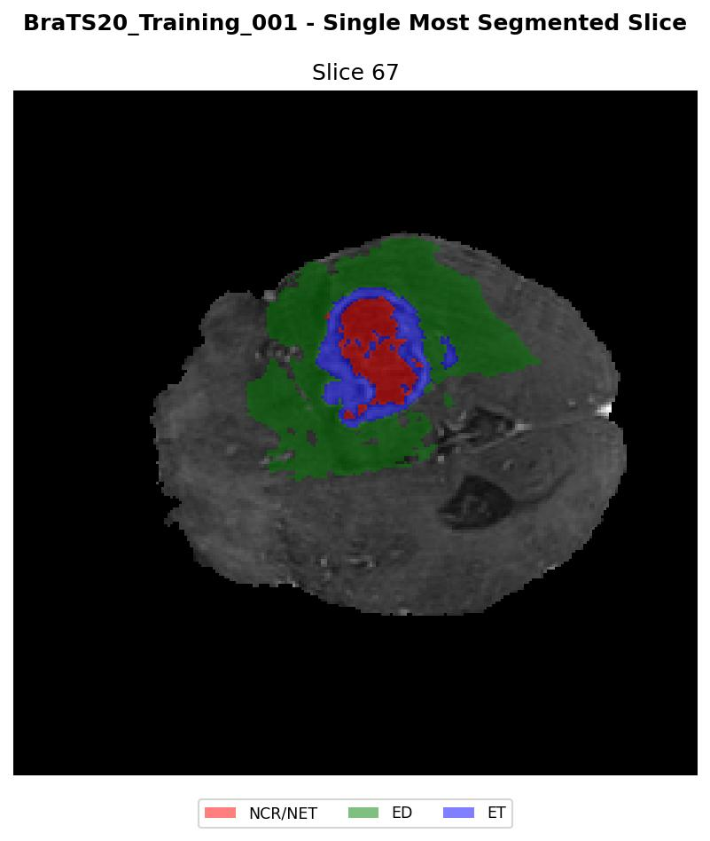

# 🧠 BraTS Brain Tumor Analysis with MedGemma Fine-Tuning

## 📋 Overview

This project implements **LoRA fine-tuning** on **MedGemma** for medical image analysis and brain tumor understanding on the BraTS dataset. Leverage parameter-efficient fine-tuning to adapt a medical language model for radiological report generation and analysis. Fine-tuning is powered by [Unsloth](https://github.com/unslothai/unsloth) for optimized performance.

## 🤖 Pre-trained Models

All models available on 🤗 **Hugging Face Hub**:

- 🧠 **MedGemma BraTS Full Model**: [Jesteban247/brats_medgemma](https://huggingface.co/Jesteban247/brats_medgemma)
- 💾 **MedGemma BraTS GGUF**: [Jesteban247/brats_medgemma-GGUF](https://huggingface.co/Jesteban247/brats_medgemma-GGUF)
- 🧪 **Experiment Results & Models**: [Jesteban247/medgemma-brats-experiments](https://huggingface.co/Jesteban247/medgemma-brats-experiments)

## 📁 Project Structure

```
├── 🧠 EDA.ipynb                    # Dataset exploration and preprocessing
├── 🏋️ Train.py                     # Main training script with Unsloth
├── 📊 Analysis.ipynb               # Training results analysis
├── 🔍 Simple_test.py               # Quick inference testing
├── 🧪 Simple_Comparison.ipynb      # Model comparison analysis
├── 📋 requirements.txt             # Python dependencies
├── 📁 Images/                      # Visualization images
└── 📁 outputs_medgemma_brats/      # Training outputs
```

## 🚀 Quick Start

### 1. 🛠️ Environment Setup

```bash
# Create and activate Conda environment
conda create --name unsloth_env \
    python=3.11 \
    pytorch-cuda=12.1 \
    pytorch cudatoolkit xformers -c pytorch -c nvidia -c xformers \
    -y
conda activate unsloth_env

# Install dependencies
pip install -r requirements.txt
```

### 2. 🧠 Explore EDA.ipynb

**Open and run `EDA.ipynb`** - This notebook:
- Downloads and explores the BraTS dataset
- Converts 3D brain scans to 2D slices
- Organizes data for MedGemma processing
- Creates `Data/` folder with processed slices
- Generates dataset statistics

### 3. 🏋️ Check Train.py

Review the training script that supports:
- **UnSloth** optimization for faster training
- **LoRA** parameter-efficient fine-tuning
- Custom learning rates and training splits

### 4. 🧪 Run Training

```bash
# Basic training (1 epoch, example LoRA config)
python Train.py --epochs 1 --train_split 0.9 --model_name brats_medgemma_r1_alpha2 --lora_r 1 --lora_alpha 2
```

Check the arguments in `Train.py` for other LoRA configurations (e.g., r=4, alpha=4).

### 5. 📊 Analyze Results

Open `Analysis.ipynb` to:
- Analyze training curves and metrics
- Compare different LoRA configurations
- Visualize model performance

Open `Simple_Comparison.ipynb` for detailed model comparison analysis.

### 6. 🔍 Quick Testing

Test inference with trained models:

```bash
python Simple_test.py
```

## 📸 Example Inference

Here's an example of radiological report generation from a BraTS brain MRI slice:



| Ground Truth | Model Prediction |
|--------------|------------------|
| The lesion area is in the right frontal and parietal lobes with a mixed pattern of high and low signals with speckled high signal regions. Edema is mainly observed in the right parietal lobe, partially extending to the frontal lobe, presenting as high signal, indicating significant tissue swelling around the lesion. Necrosis is within the lesions of the right parietal and frontal lobes, appearing as mixed, with alternating high and low signal regions. Ventricular compression is seen in the lateral ventricles with significant compressive effects on the brain tissue and ventricles. | Analysis of this brain MRI reveals: The lesion area is in the right cerebral hemisphere, particularly in the frontal and parietal lobes, with a mixture of heterogeneous high and low signals, accompanied by speckled high signal areas. Edema is significant in the right frontal and parietal regions, with considerable swelling of the surrounding tissues, indicating a severe level of tissue damage. Necrosis is suggested by some low signal areas in the right parietal lobe, with mixed signal intensity, suggesting potential necrosis that is relatively dispersed. Ventricular compression is observed with the right lateral ventricle noticeably compressed, while the left lateral ventricle shows slight deformation. |

## 🔬 Key Features

- ⚡ **UnSloth**: 2-5x faster training with memory optimization
- 📚 **LoRA Fine-tuning**: Parameter-efficient adaptation (~1% of model parameters)
- 🏥 **Medical Datasets**: BraTS brain tumor data with clinical annotations
- 🤗 **Hugging Face**: Full integration for model sharing and deployment
- 💾 **GGUF Support**: Quantized model format for efficient inference
- 📊 **Comprehensive Experiments**: Multiple LoRA configurations tested

## ⚠️ Medical Disclaimer

This project is for research purposes only. Models should not be used for clinical diagnosis without proper validation and regulatory approval.