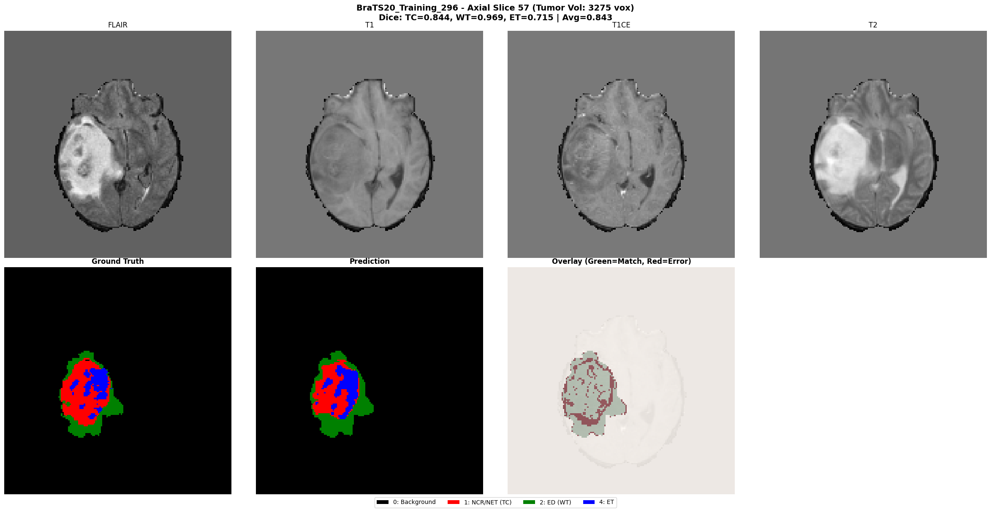
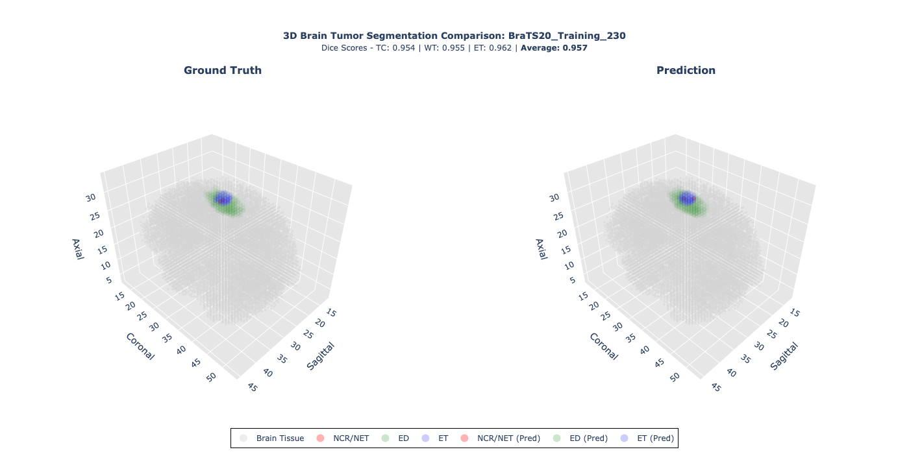

# 🧠 BraTS Brain Tumor Segmentation with SegResNet

## 📋 Overview

This project implements 3D brain tumor segmentation using **SegResNet** and **MONAI** on the BraTS 2020 dataset. It performs multi-class segmentation of brain tumors into three regions: Tumor Core (TC), Whole Tumor (WT), and Enhancing Tumor (ET).

## 🤖 Pre-trained Model

The trained model is available on 🤗 **Hugging Face Hub**:

- 🧠 **BraTS SegResNet**: [Jesteban247/brats-segresnet-monai](https://huggingface.co/Jesteban247/brats-segresnet-monai)

## 📁 Project Structure

```
├── 🧠 EDA.ipynb                    # Dataset exploration and preprocessing
├── 🏋️ Train.py                     # Main training script with MONAI + Accelerate
├── 📊 Analysis.ipynb               # Training results analysis
├── 🔍 Predictions.ipynb            # Inference and visualization
├── 🔄 Convert_to_onnx.py           # Model conversion to ONNX
├── 📋 requirements.txt             # Python dependencies
├── 📁 Images/                      # Visualization images
└── 📁 Outputs/                     # Training outputs and checkpoints
```

## 🚀 Quick Start

### 1. 🛠️ Environment Setup

```bash
# Install Miniconda
curl -O https://repo.anaconda.com/miniconda/Miniconda3-latest-Linux-x86_64.sh
bash Miniconda3-latest-Linux-x86_64.sh

# Initialize Conda
source ~/miniconda3/bin/activate

# Accept Terms of Service
conda tos accept --override-channels --channel https://repo.anaconda.com/pkgs/main
conda tos accept --override-channels --channel https://repo.anaconda.com/pkgs/r

# Create and activate environment
conda create -n brats-env python=3.12 -y
conda activate brats-env
pip install -r requirements.txt
```

### 2. ⚡ Accelerate Configuration (Multi-GPU)

For multi-GPU training, configure Accelerate:

```bash
accelerate config
```

Recommended settings:
- Compute Environment: This machine
- Machine Type: multi-GPU
- Number of Machines: 1
- GPUs for Training: all
- Mixed Precision: fp16

### 3. 🧠 Data Preprocessing

Open and run `EDA.ipynb` to:
- Download and extract the BraTS dataset
- Explore the BraTS dataset structure
- Preprocess and organize the data
- Create train/val/test splits
- Generate data loaders

### 4. 🏋️ Training

Train the SegResNet model:

```bash
# Single GPU training
python Train.py --data_dir Data/MICCAI_BraTS2020_TrainingData --epochs 100

# Multi-GPU training with Accelerate
accelerate launch --num_processes 2 Train.py --mixed_precision fp16 --epochs 100
```

Check the arguments in `Train.py` for customization.

### 5. 📊 Analysis

Open `Analysis.ipynb` to:
- Analyze training curves and metrics
- Compare different training runs
- Visualize model performance

### 6. 🔍 Inference and Evaluation

Use `Predictions.ipynb` for:
- Running inference on test data
- Visualizing segmentation results
- Computing evaluation metrics

Use `Model_Prediction_Evaluation.ipynb` for comprehensive evaluation.

### 7. 🔄 Model Conversion

Convert trained PyTorch model to ONNX:

```bash
python Convert_to_onnx.py \
  --checkpoint_path Outputs/SegResNet_brats_accelerate_YYYYMMDD_HHMMSS/model_final_YYYYMMDD_HHMMSS.pth \
  --output_path Outputs/model.onnx
```

## 📸 Example Predictions

Here are examples of segmentation results on BraTS data:

### 2D Prediction



### 3D Prediction



## 🔬 Key Features

- 🧠 **3D Segmentation**: Multi-class brain tumor segmentation
- 🏥 **BraTS Dataset**: MICCAI BraTS 2020 challenge data
- 🔥 **SegResNet**: State-of-the-art segmentation architecture
- ⚡ **MONAI Framework**: Medical imaging specialized library
- 🚀 **Accelerate**: Multi-GPU training support
- 📊 **Comprehensive Evaluation**: Dice scores, precision, recall per class
- 🔄 **ONNX Export**: Model deployment ready

## 📈 Model Classes

The model segments brain tumors into 4 classes (including background):
- **Background**: Non-tumor tissue
- **Tumor Core (TC)**: Necrotic core + non-enhancing tumor
- **Whole Tumor (WT)**: TC + edema
- **Enhancing Tumor (ET)**: Enhancing tumor regions

## ⚠️ Medical Disclaimer

This project is for research purposes only. Models should not be used for clinical diagnosis without proper validation and regulatory approval.