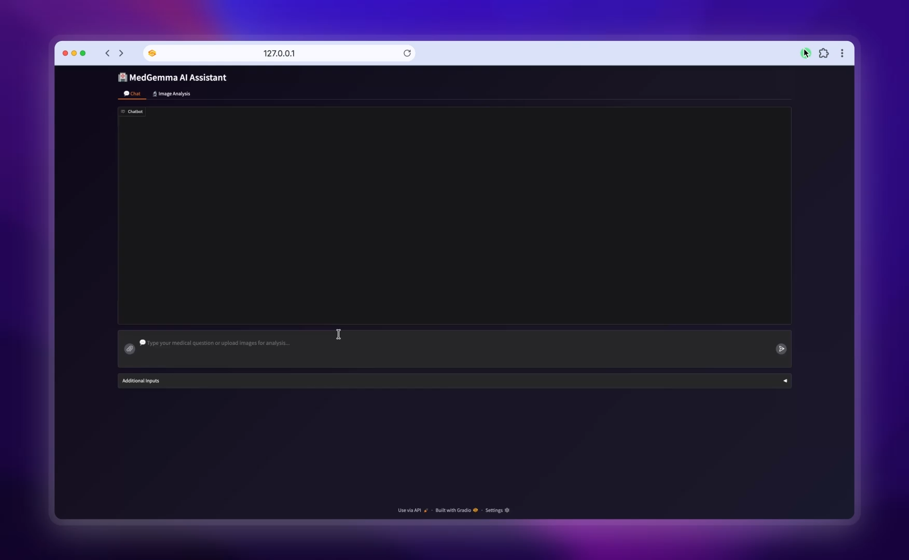

# 🏥 MedGemma AI Assistant - Unified Medical Image Analysis

## 📋 Overview

**MedGemma AI Assistant** is a medical AI platform that combines computer vision models with language models for medical image analysis. The system provides classification, detection, segmentation, and AI-powered radiological reports through a unified Gradio interface.

**Note on MedGemma Fine-tuning**: Fine-tuning Med-Gemma on small medical datasets risks catastrophic forgetting, where the model loses general multimodal capabilities while gaining domain-specific performance. Though LoRA reduces computational costs, it doesn't prevent this trade-off between specialization and cross-domain generalization. This project uses context engineering instead: structured outputs from specialized vision models guide the unfine-tuned Med-Gemma, preserving its broad medical knowledge while enabling domain-specific interpretation.

## 🎥 Demo Video

[](https://drive.google.com/file/d/1Ny6ME_Vf9PkxZCW7kIvOm7X-ebB_OeM_/view?usp=share_link)

## 🤖 Integrated Models

All models are available on 🤗 **Hugging Face Hub**:

### Classification Models
- 🧠 **Brain Tumor**: [Jesteban247/mobilevit_small-brain_tumor](https://huggingface.co/Jesteban247/mobilevit_small-brain_tumor)
- 🫁 **Chest X-Ray**: [Jesteban247/mobilevit_small-chest_xray](https://huggingface.co/Jesteban247/mobilevit_small-chest_xray)
- 🧬 **Lung Cancer**: [Jesteban247/mobilevit_small-lung_cancer_histopathological](https://huggingface.co/Jesteban247/mobilevit_small-lung_cancer_histopathological)

### Detection Models
- 🩸 **Blood Cell**: [Jesteban247/yolo11-blood_cell-onnx](https://huggingface.co/Jesteban247/yolo11-blood_cell-onnx)
- 🫃 **Breast Cancer**: [Jesteban247/yolo11-breast_cancer-onnx](https://huggingface.co/Jesteban247/yolo11-breast_cancer-onnx)
- 🦴 **Fracture**: [Jesteban247/yolo11-fracture-onnx](https://huggingface.co/Jesteban247/yolo11-fracture-onnx)

### Segmentation Models
- 🧠 **BraTS 3D**: [Jesteban247/brats-segresnet-monai](https://huggingface.co/Jesteban247/brats-segresnet-monai)

### Language Models
- 🧠 **MedGemma Base**: [Jesteban247/medgemma-4b-it](https://huggingface.co/Jesteban247/medgemma-4b-it)
- 🧠 **MedGemma Base GGUF**: [unsloth/medgemma-4b-it-GGUF](https://huggingface.co/unsloth/medgemma-4b-it-GGUF)
- 🧠 **MedGemma BraTS FT**: [Jesteban247/brats_medgemma](https://huggingface.co/Jesteban247/brats_medgemma)
- 🧠 **MedGemma BraTS FT GGUF**: [Jesteban247/brats_medgemma-GGUF](https://huggingface.co/Jesteban247/brats_medgemma-GGUF)

## 📁 Project Structure

```
├── 🏥 app.py                    # Main Gradio UI application
├── 🚀 start.py                  # Unified launcher (local + HF Spaces)
├── 📋 requirements.txt          # Python dependencies
├── 📹 Video.mp4                 # Demo video
├── 📁 src/                      # Core application modules
├── 📁 Develop/                  # Development notebooks & training
│   ├── 🧠 Classification/       # Image classification experiments
│   ├── 🎯 Detection/            # Object detection experiments
│   ├── 🧠 Medgemma_FT/          # LLM fine-tuning
│   └── 🧠 Segmentation/         # 3D segmentation experiments
├── 📁 Models/                   # Pre-trained model files
├── 📁 Images/                   # Sample images and visualizations
└── 📁 Files_Seg3D/              # BraTS 3D segmentation data
```

## 📚 Development Projects

Individual development projects with training notebooks and experiments:

- 🧠 **Classification**: [Develop/Classification/](Develop/Classification/) - MobileViT models for brain tumor, chest X-ray, and lung cancer classification
- 🎯 **Detection**: [Develop/Detection/](Develop/Detection/) - YOLO11 models for blood cell, breast cancer, and fracture detection  
- 🧠 **MedGemma Fine-tuning**: [Develop/Medgemma_FT/](Develop/Medgemma_FT/) - LoRA fine-tuning experiments on BraTS dataset
- 🧠 **Segmentation**: [Develop/Segmentation/](Develop/Segmentation/) - 3D brain tumor segmentation with SegResNet

## 🚀 Quick Start

### 1. 🛠️ Environment Setup

```bash
# Install Miniconda (if not already installed)
curl -O https://repo.anaconda.com/miniconda/Miniconda3-latest-Linux-x86_64.sh
bash Miniconda3-latest-Linux-x86_64.sh

# Initialize Conda
source ~/miniconda3/bin/activate

# Create and activate environment
conda create -n medgemma python=3.13 -y
conda activate medgemma

# Install Python dependencies
pip install -r requirements.txt
```

### 2. 📥 Download Models

Download the required models from the links above and organize them in the following structure:

```
Models/
├── Classification/
│   ├── chest-xray/
│   │   ├── model.safetensors
│   │   ├── config.json
│   │   └── preprocessor_config.json
│   ├── lung-cancer/
│   │   ├── model.safetensors
│   │   ├── config.json
│   │   └── preprocessor_config.json
│   └── brain_tumor/
│       ├── model.safetensors
│       ├── config.json
│       └── preprocessor_config.json
├── Seg_3D/
│   └── Brats.onnx
├── Medgemma_FT/
│   ├── mmproj_model_f16.gguf
│   └── brats_medgemma-q5_k_m.gguf
├── Medgemma_Base/
│   ├── mmproj-F16.gguf
│   └── medgemma-4b-it-Q5_K_M.gguf
└── Detection/
    ├── Fracture.onnx
    ├── Blood_Cell.onnx
    └── Breast_Cancer.onnx
```

### 3. 🦙 Install Llama.cpp (for local LLM inference)

Follow the official installation guide: [llama.cpp Installation](https://github.com/ggml-org/llama.cpp/blob/master/docs/install.md)

### 4. ▶️ Launch the Application

```bash
# Start all services (model servers + UI)
python start.py
```

The launcher will:
- ✅ Check all requirements
- 🔧 Start model inference servers (classification, detection, segmentation)
- 🦙 Start MedGemma LLM servers (base + fine-tuned)
- 🌐 Launch Gradio UI at http://127.0.0.1:7860

### 5. 🎯 Use the Application

1. **Open your browser** to the Gradio URL shown in terminal
2. **Upload medical images** for analysis
3. **Select analysis type**: Classification, Detection, or Segmentation
4. **Chat with MedGemma** for detailed radiological reports
5. **View Grad-CAM visualizations** for model explainability

## ⚠️ Medical Disclaimer

This project is for **research and educational purposes only**. The AI models and generated reports should **not** be used for clinical diagnosis or treatment decisions. Always consult qualified medical professionals for patient care. The models may produce incorrect results and should be validated thoroughly before any medical application.
